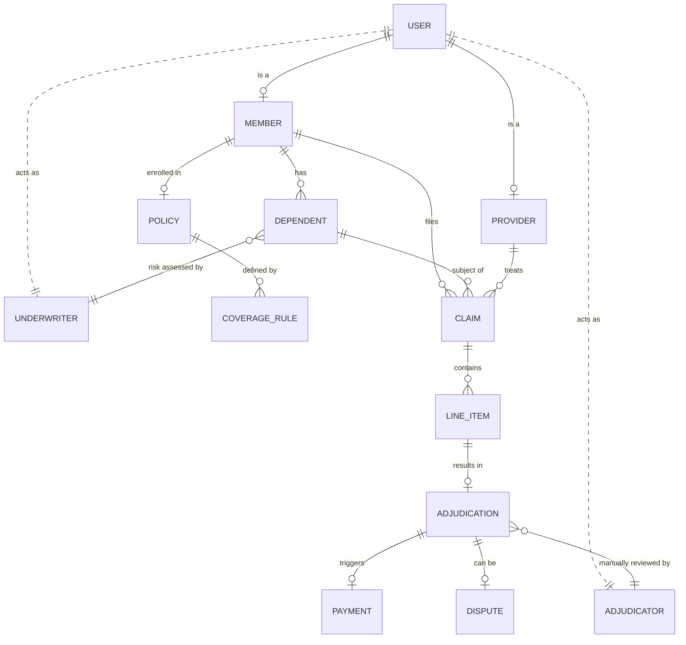
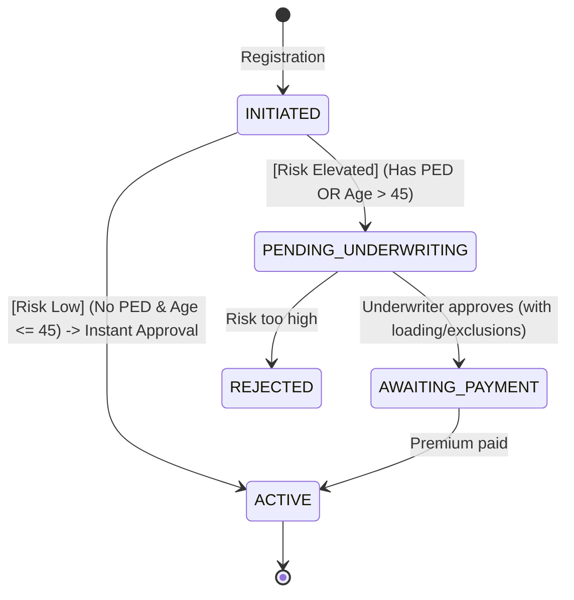
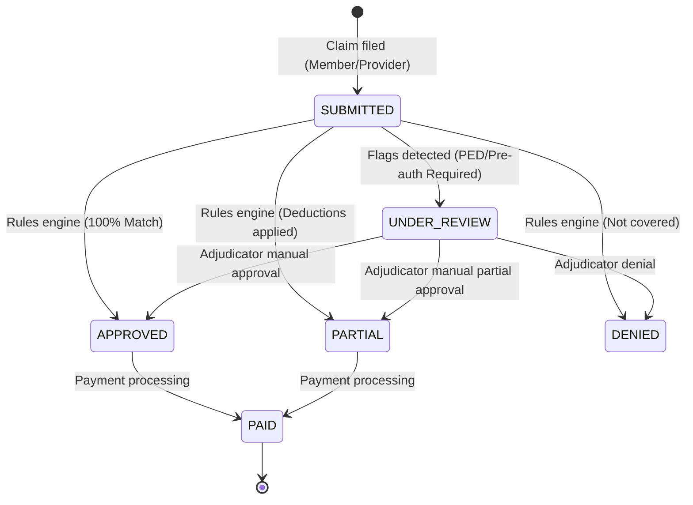
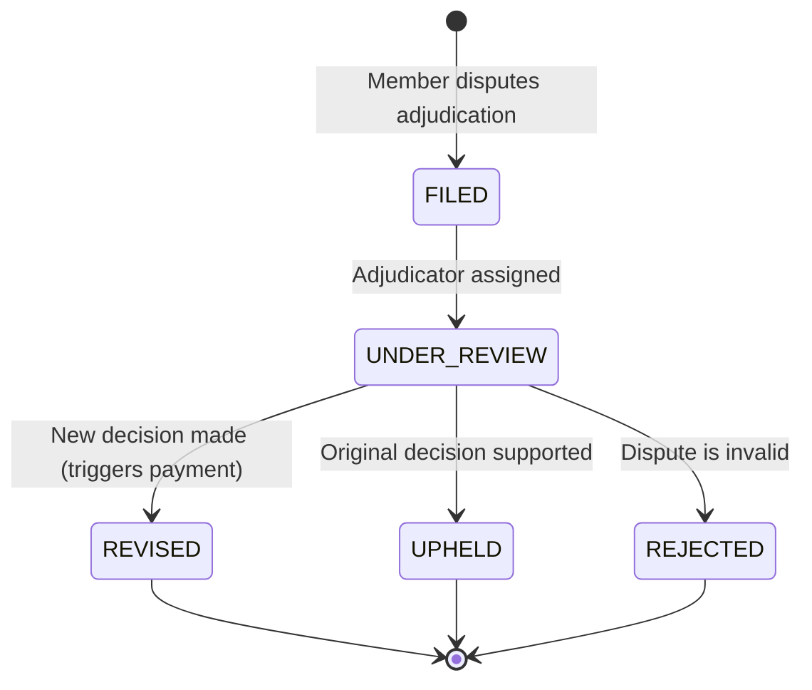

# Domain Model Documentation: RealFast Claims

This document outlines the core architecture, data entities, and logic engines of the RealFast Claims health insurance platform.

## 1. Core Entities & Relationships

The system is built on a relational foundation that separates **Identity (User)**, **Policy (Product)**, and **Transactions (Claims/Payments)**.

### Key Components & Actors:
- **Service-Facing Roles (Underwriter & Adjudicator)**: These are specialized `User` roles that don't have separate profile tables (unlike Members/Providers) because their data is primarily transactional/linked to Audit Logs. They are the **drivers** of the system's state machines.
- **Member & Dependent**: The `Member` is the primary policy holder. `Dependents` share the policy's annual limit and deductible (if a Family Floater).
- **Coverage Rules**: A policy doesn't just have a "limit"; it has a granular list of `CoverageRule` entities that define if a service (e.g., *Surgery, Consultation, AYUSH*) is covered, its sub-limit, and if it requires pre-authorization.
- **Adjudication**: Not just a status, but a detailed entity capturing mathematical breakdown: `approved_amount`, `member_owes`, and `denial_reason`.

---

## 2. State Machines

The "RealFast" experience relies on predictable, state-driven workflows for risk assessment and financial settlement.

### A. Underwriting Lifecycle (Risk Modeling)
Driven by the `UNDERWRITER` role, this state machine evaluates new risks for dependents. The **"RealFast" Decision Engine** automatically determines the path based on the applicant's risk profile.

1.  **INITIATED**: Initial registration of the dependent.
2.  **ACTIVE (Instant Approval)**: High-growth path for young, healthy applicants. No Underwriter interaction required.
3.  **PENDING_UNDERWRITING**: Awaiting clinical review by an `UNDERWRITER` (triggered by Age or PED).
4.  **AWAITING_PAYMENT**: Approved by underwriting with potential "loading" (premium increase) and exclusions.
5.  **ACTIVE (Manual Path)**: Coverage live after processing payment for the assessed risk.
6.  **REJECTED**: Denied based on medical history.

---

### B. Claim Adjudication Lifecycle
Driven by the `ADJUDICATOR` role and the automated Rules Engine.

1.  **SUBMITTED**: Initial persistence.
2.  **UNDER_REVIEW**: Automatic rules engine detected a high-risk flag (e.g., PED match or Pre-auth required). Requires manual intervention from an `ADJUDICATOR`.
3.  **APPROVED / PARTIAL / DENIED**: Final decision by the rules engine or manual adjudicator.
4.  **PAID**: Financial settlement complete.

---

### C. Dispute Resolution Loop
Managed by a senior `ADJUDICATOR` when a member contests a decision.

1.  **FILED**: Member contests an adjudication.
2.  **UNDER_REVIEW**: Clinical/Legal review by an adjudicator.
3.  **REVISED / UPHELD**: Final outcome. A `REVISED` outcome triggers a supplemental payment.

---

## 3. Modeling Coverage Rules (The Logic Engine)

The system uses a **multi-tiered mathematical pipeline** to process claims. Rules are applied in a strict, industry-standard order to ensure financial accuracy.

### The Adjudication Pipeline:
1.  **Deductible (First-Dollar Responsibility)**: The member pays 100% of the claim until their annual deductible is met.
2.  **Room Rent Daily Cap**: If a member stays in a room costing ₹10,000/day but their policy limit is ₹5,000/day, the daily cap is applied immediately.
3.  **Proportionate Deduction (The "Room Choice" Penalty)**:
    - **Logic**: If the room chosen exceeds the policy limit, all other "proportional" line items (surgeon fees, diagnostics) are reduced by the same ratio.
    - **Example**: If room cost is 2x the limit, other charges are reduced by 50%.
4.  **Copay (Co-Insurance)**:
    - **Network Awareness**: The system applies different copay percentages (e.g., 10% vs 30%) based on whether the `Provider` is `IN_NETWORK` or `OUT_OF_NETWORK`.
5.  **Policy & Global Limits**: The final approved amount is checked against the service-specific `limit_per_year` and the member's remaining `annual_limit`.

---

## 4. Financial Transparency
- **Deductible Journey**: Tracked real-time via `member.deductible_met`.
- **Limit Saturation**: Tracked via `member.limit_used`.
- **EOB (Explanation of Benefits)**: A post-claim summary entity that stores the complete mathematical breakdown in `breakdown_json` for auditing and member visibility.
